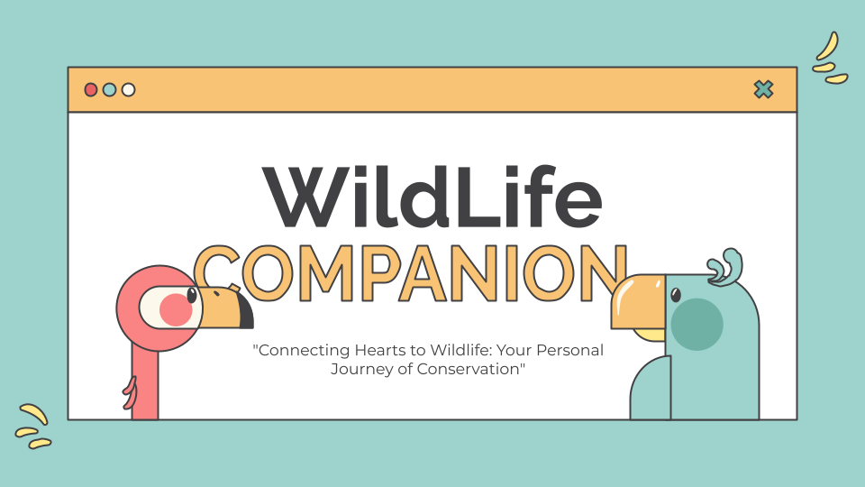

<p align="center">
  <a href="" rel="noopener">
 </a>
</p>
<h3 align="center">Wildlife Companion</h3>

<div align="center">

</div>

---

<p align="center"> This project was created as part of Girls in Tech: Hack for the Environment -Hackathon (https://hackfortheenvironmentwith-git.devpost.com/).

</p>

## 📝 Table of Contents
- [Problem Statement](#problem_statement)
- [Idea / Solution](#idea)
- [Prototype](#prototype)
- [Production Architecture](#future_scope)
- [Setting up a local environment](#getting_started)
- [Usage](#usage)
- [Technology Stack](#tech_stack)
- [Authors](#authors)

## 🧐 Problem Statement <a name = "problem_statement"></a>
The category we selected for our project is 'Endangered species. How might we use technology/AI to increase animal biodiversity?'

There is an uneven distribution of funds for endangered animals - ‘cute’ animals get more funding while other species remain underfunded. For example, birds often receive less funding than mammals. With this project, we want to create something that would secure more donations for endangered birds and in the future possibly other underfunded species.
 

## 💡 Idea / Solution <a name = "idea"></a>
We wanted to create something that is engaging and makes the user feel like they have a personal connection with the bird. There are many schemes to ‘adopt an animal’, however, the user usually doesn't usually get much in return. We were thinking of ways to make this more engaging so that it would appeal to a larger audience and make people commit to a monthly subscription towards the conservation of these animals.

A personal connection to the bird would be created by having access to an application, where the user is able to track the animal they have adopted as well as receive regular updates about the animal’s daily life, almost like a social media feed. Especially for migrating birds, the tracking element would make it quite interesting as the user could follow in real time the large distance the bird is travelling. The updates on the feed would be generated by AI by using tracking data, weather data and data from other sources. The user would also have access to a chatbot to ask questions about their adopted bird. 

## ⛓️ Prototype <a name = "prototype"></a>
The frontend of our prototype has been created with React. While currently designed as a web application, it could be in the future transitioned into a Progressive Web App (PWA) as most users would probably want to access it using mobile phones.

The coordinates on the map are currently created randomly every time the user re-opens the map to give an idea of how the route the bird has flown during the last 24 hours would be shown. The chatbot is currently able to answer some of the most common questions the users could ask.

The below diagram provides an overview of the architectural design for our prototype:

TODO add diagram

## 🚀 Production architecture <a name = "future_scope"></a>
The below architectural diagram provides an overview of the proposed system design for a production application, highlighting key components and interactions that ensure reliability and scalability. 

TODO add diagram

As the design requires access to tracking information of the bird, this would be implemented by using an AI-powered tag. The proposed hardware design is described below:

<a href="https://ibb.co/H71Nt5K"></a>

The communication flow would be following:

- The Arduino Uno reads data from the sensors.
- The Arduino Uno processes the data and sends it to the ESP32 through serial communication.
- The ESP32 packages the data into JSON format.
- The ESP32 establishes a Wi-Fi connection and sends an HTTP POST request containing the data to the AWS Lambda function.
- AWS Lambda function receives the HTTP POST request, processes the JSON data, and stores it in the Amazon DynamoDB.

Further technical details are available in this [file](./assets/AITaggerPrototypeDesign.md).


## 🏁 Getting Started <a name = "getting_started"></a>
These instructions will get you a copy of the project up and running on your local machine for development 
and testing purposes. 

### Prerequisites

You need an AWS Lambda function with the code available in the AWS/Lambdas -folder. You also need to create an AWS API Gateway that is integrated with the Lambda function. The API endpoint URL needs to be added to ``App.js``.

You also need a chatbot created with Watson Assistant that will be embedded in the ChatBot -component. 

### Installing

Install project dependencies:

```
npm install
```

To run this project locally run:

```
npm start
```

Run the Development Server: Once the dependencies are installed, you can start the development server by running:

This command will build the project and start a local development server. You'll see messages indicating that the project is being compiled and the server is running.

Access the Application: Open a web browser and navigate to http://localhost:3000. This is the default address where the React application will be served. You should see your React app running locally.

## 🎈 Usage <a name="usage"></a>
Add notes about how to use the system.

## ⛏️ Built With <a name = "tech_stack"></a>
- [React](https://www.react.dev/) - Frontend Framework
- [AWS Lambda](https://aws.amazon.com/lambda/) - A serverless, event-driven compute service
- [AWS API Gateway](https://aws.amazon.com/api-gateway/) - A fully managed API service
- [Leaflet](https://leafletjs.com//) - an open-source JavaScript library for mobile-friendly interactive maps
- [Watson Assistant](https://www.ibm.com/products/watson-assistant/) - ChatBot

## ✍️ Authors <a name = "authors"></a>
- [@merylnadia](https://github.com/merylnadia) - UX design
- [@MARYANNE67](https://github.com/MARYANNE67) - Frontend application
- [@rashafathima](https://github.com/rashafathima) - Chatbot, hardware design
- [@mariberg](https://github.com/mariberg) - AWS, architectural diagrams, documentation
