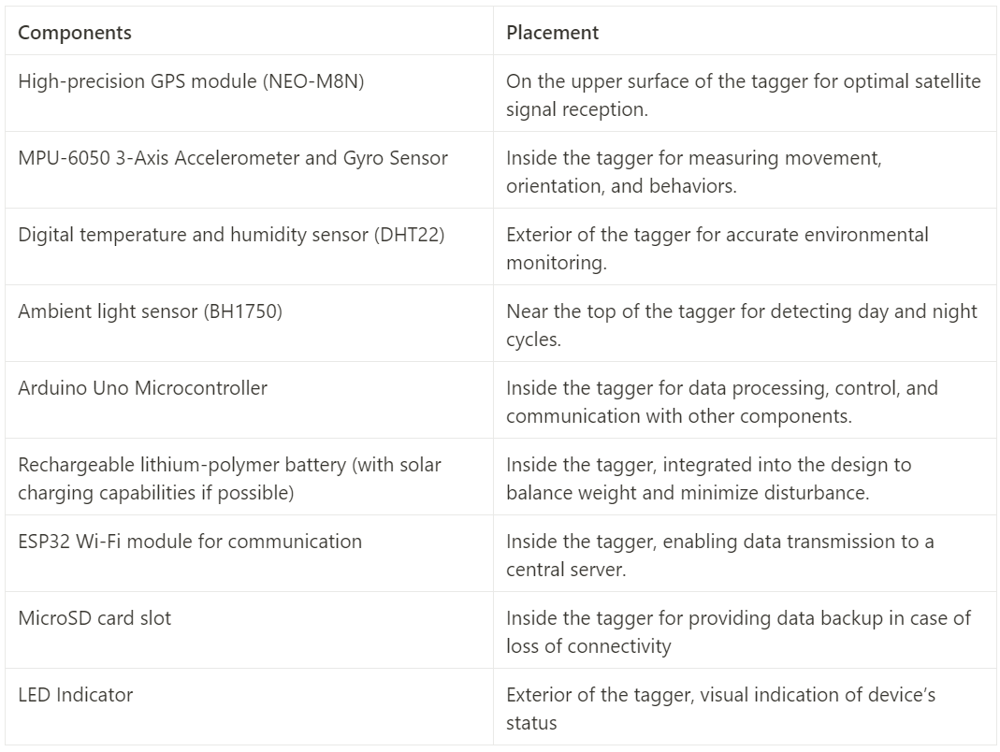

# Components and Placement

## Form Factor:

Material: Lightweight, durable, and animal-friendly materials

Design:  Adjustable band having a small, lightweight module with a streamlined design to minimize the impact on the animal

# Working

**1. Data Collection and Processing:**

- The sensors (MPU-6050, DHT22, NEO-M8N GPS module, and BH1750 light sensor) will collect data based on their specifications.
- The Arduino Uno will process the collected sensor data and make decisions based on predefined logic.

**2. Wireless Communication:**

- The ESP32 Wi-Fi module will be responsible for connecting to the Wi-Fi network and transmitting data to the central server (AWS) using HTTP requests.
- The ESP32 will periodically collect data from the Arduino Uno and sensors and package it into JSON format.

**3. Real-Time Data Transmission:**

- The ESP32 will use the HTTP protocol to send real-time data to the AWS server. This involves creating HTTP POST requests with the collected data in JSON format.

**4. Backup Data Storage:**

- The ESP32 can also log data onto the MicroSD card for backup purposes in case there's a temporary loss of connectivity to the server.
